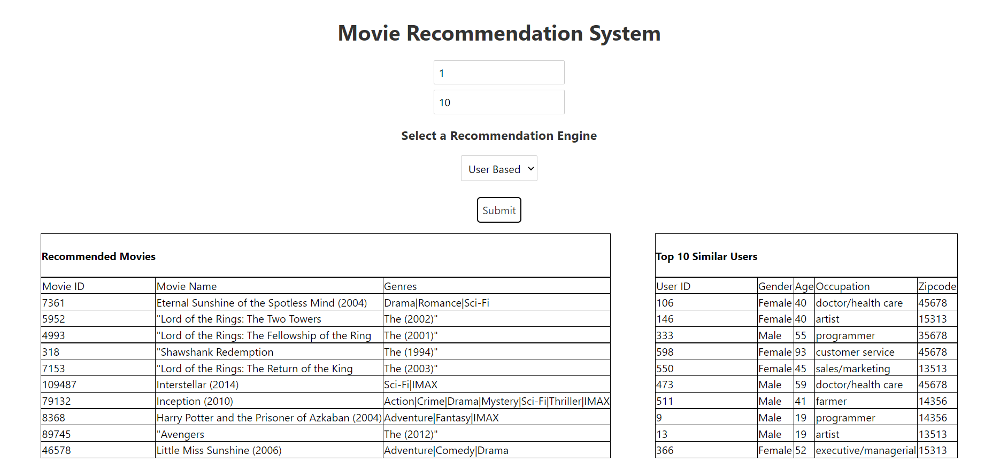

# Movie Recommendation System 


How to run?

1. Install Java Dependencies using Maven or IDE 
2. Run Java source code
3. Go to client folder and run
```
npm install
```
4. Run the frontend using
```
npm run dev
```


## Screenshots



